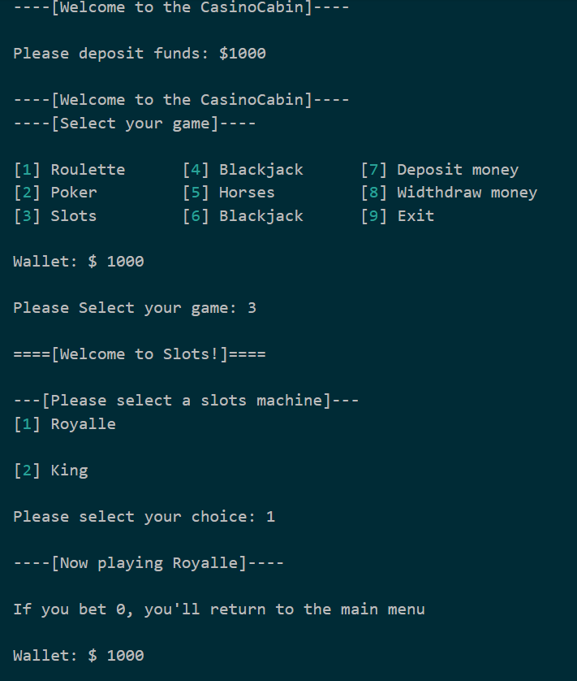
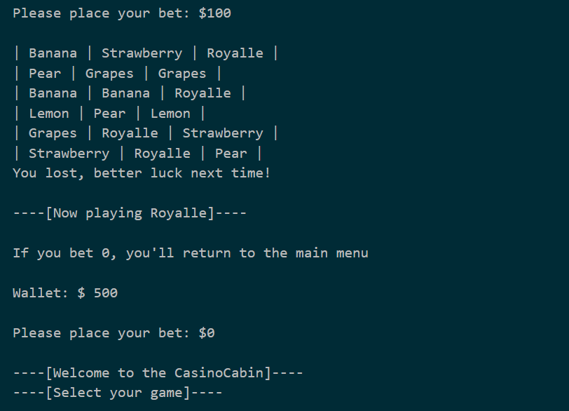
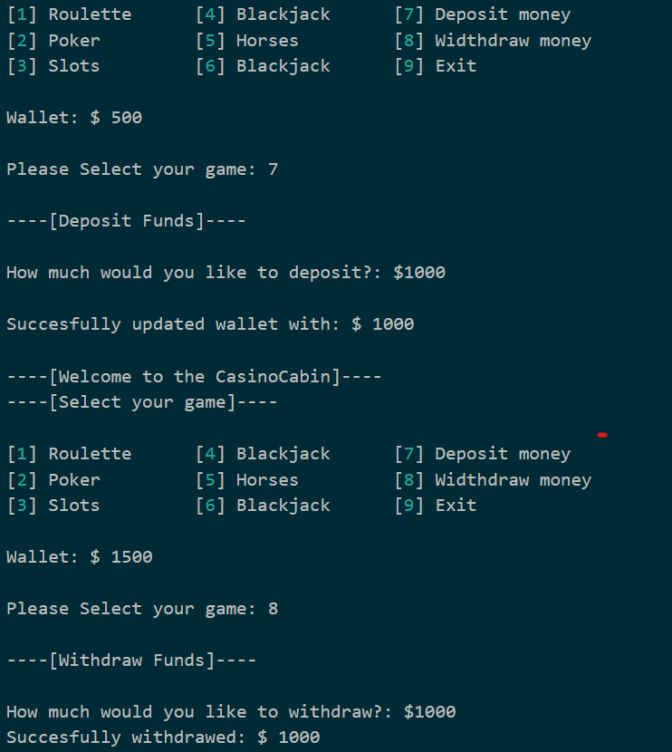
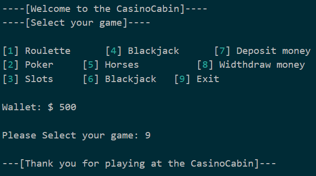

# CasinoCabin

### Adam Grinde
### TEINF-20

## Description

Det här är mitt slutprojekt i programering 1. Syftet är att visa vad jag lärt mig under läsåret samt påvisa mina kunskaper ännu en gång. Programmet är skrivet i Python.

## Built with

Mitt pogram är byggt av python. Jag använder mig av import time, import os samt import random för att få mitt pogram att fungera.

## Requirements

- Python 3.7+

## Installation

1. KSSSlona repot
   git clone https://github.com/AdamGrinde/CasinoCabin
2. Installera Python

## Usage

Mitt pogram är enkelt att använda. Följ instruktionerna som kommer upp när du kör pogramet så fungerar det, meningen är att det ska vara lätt att följa och enkelt att använda. Än sålänge finns det endast slots spel att spela så om man väljer något av de andra spelen kommer det stå under construction och man kommer bli tillbakaförd till huvudmenyn.

### Playing example

## To Do

- ~~Göra projektplan~~
- ~~Koda huvudmenyn~~
- ~~Koda slotsmaskiner~~
- Koda blackjack
- Koda horsebetting
- Koda Poker
- Koda Roulette
- Bugghantering
- Få spelet att inte kracha när fel sak skrivs in
- Lägga till fler spel
- Få pogrammet mer felsäkert

## Changelog

Då det har blivit något konstigt med min GitHub kan jag ej se alla tidigare verisioner.

Verision 1.1

- Lagt till huvudmeny

Verision 1.2

- Skapat bank

Verision 1.3

- Skapat spelmeny
- Skapat Slots maskiner

Verision 1.4

- Gjort stora förändringar för att få allting att kopplas samman
- Tagit bort filer och skapat en stor fil istället

## Licence

[MIT](https://choosealicense.com/licenses/mit/)

## Contact

- Adam Grinde - adam.grinde@elev.ga.ntig.se

- Projektlänk: https://github.com/AdamGrinde/CasinoCabin

## Acknowledgements

- Elliot Eriksson (@Okand#3437)
